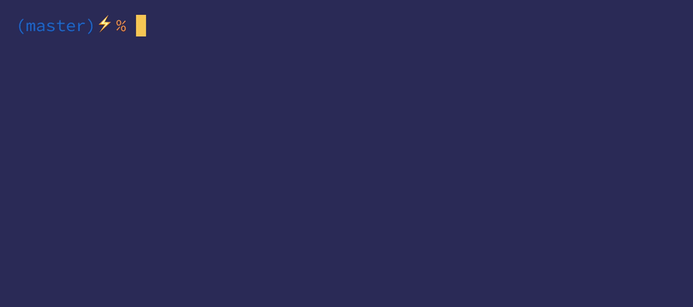

# Lana! NPM scripts with better UX 🌈

## What?

Lana! provides a convenient, global API to browse and run NPM scripts in your projects.
Also, it makes managing your documentation easier by pulling out descriptions from your projects' README.md file.

## Why?

Do you happen to switch between your projects often and rely on reading package.json to look up the dev tasks? 
Well, I do. So give it a try. Your OCD will thank you.

## Why not?

There are many ways of tackling this issue, usually script names should be descriptive enough or one might say `package.json` is not the right place for that at all.

Normally, I'd agree with that, but it suits my workflow and might help you as well.

## Setup

### Yarn
    $ yarn global add lana

### NPM
    $ npm i -g lana

## Usage

In a Javascript project with `package.json`, type:

    $ lana

You can share documentation between lana! and README.md by tagging content, like in this imaginary CMS (Cat Management System).

### Usage

#### Start web server <!--lana: start-->
    $ npm start

#### Download kittens <!--lana: download kittens-->
    $ npm run download-kittens

#### Upload kittens <!--lana: upload-kittens-->
    $ npm run upload-kittens

#### Download database for integration tests <!--lana: integration-db-download-->
    $ ./build/prepare_db.sh && npm run integration-db-download

